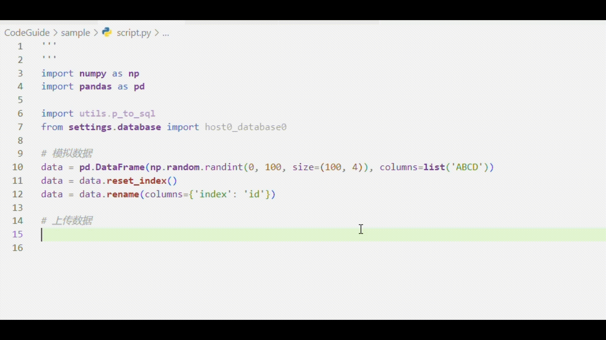

## AI 辅助编写

> 当我们的代码可读性较高时，AI便可更准确地理解我们的代码，并在此之上辅助编写代码
>
> 按照指南编写将使代码具备高可读性

### 数据上传demo

#### 为多线程写入MySQL数据库脚本添加注释

- 该脚本在自建库 `utils` 中单独摘出并删除了所有注释

- 在代码可读性较高（即使无注释）的情况下，可用AI补全注释

- AI参考了库中其余脚本的 `Docstring` 格式，并使用一致的 `Docstring` 风格

- 当然，AI补全的 `Docstring` 只是格式上正确，内容上欠缺准确性，且犯了知识错误（比如没有区分处理器核心和线程）

#### 存储数据库账号密码地址端口库名等信息，并进行数据库引擎创建

- 在写好地址、端口、库、用户名、密码后，添加一个数据库引擎的demo，其余的便可自动补全

- 当然，地址、端口、库、用户名、密码分布有规律的情况下，也可自动补全

#### 编写数据上传脚本

- 导入所需依赖后，在上一行写上 `# 上传数据`，回车，AI便可进行根据依赖（本例中主要依赖 `p_to_sql` 的 `TypeHint`）进行自动补全

